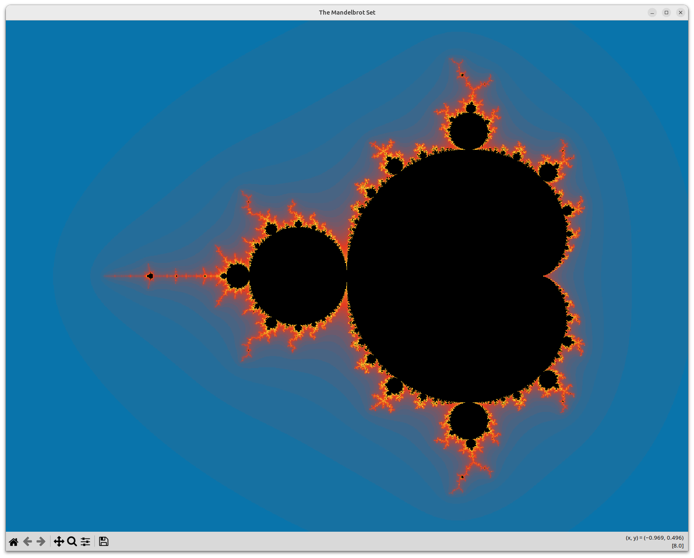

# Mandelbrot Zoom
This little Python program renders the Mandelbrot set on the screen and allows you to zoom in and out with a mouse click.

## Requirements
The program used NumPy for calculations, Numba to execute heavy computations on the GPU, and Matplotlib to render the figures.

## Usage
Start the program from the terminal
```
python mandelbrot-zoom.py
```
A window opens, showing the Mandelbrot set.



When you click the picture with the **left** mouse button, the program **zooms in** by a factor of 5, centred on the point you clicked.

When you click the picture with the **right** mouse button, the program **zooms out** by a factor of 5, centred on the point you clicked.

When you press the key **t**, the program saves the current picture at high resolution (12 000 x 9 000 pixels) as `mandelbrot-1.png`. The next picture in the same session will be saved as `mandelbrot-2.png` and so on...

When you press the key **q**, the window closes and the program quits.
